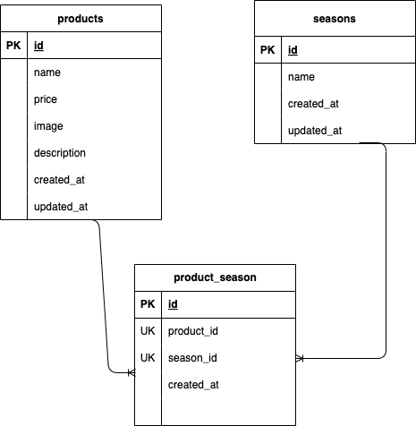

## アプリケーション名
確認テスト：お問い合わせフォーム
## ER図

## 環境構築
1.リポジトリからダウンロード
$git clone git@github.com:KoumotoAkiko/koumotoAkiko-kadai.git

2.srcディレクトリにある「.env.example」をコピーして 「.env」を作成し DBの設定を変更
$ cp .env.example .env

DB_HOST=mysql
DB_DATABASE=laravel_db
DB_USERNAME=laravel_user
DB_PASSWORD=laravel_pass

3.dockerコンテナを構築
$ docker-compose up -d --build

*MySQLは、OSによって起動しない場合があるのでそれぞれのPCに合わせてdocker-compose.ymlファイルを編集してください。

4.Laravelをインストール
$ docker-compose exec php bash
> composer install

5.アプリケーションキーを作成
> php artisan key:generate

6.DBのテーブルを作成
> php artisan migrate

7.DBのテーブルにダミーデータを投入
> php artisan db:seed

"The stream or file could not be opened"エラーが発生した場合
ディレクトリ/ファイルの権限を変更
$ sudo chmod -R 777 src/storage

## 使用技術
・Lalavel 8.83.8
・PHP 7.4.9
・Mysql 15.1
・Composer 2.8.4

## URL
・環境開発：http://localhost/
・phpMyAdmin:http://localhost:8080/